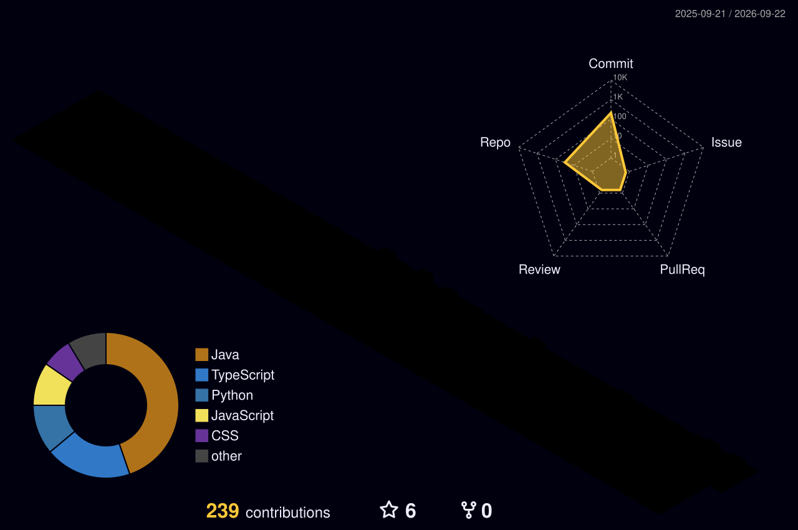

<div align="center">


### 👋 Building scalable software, intelligent systems, and production-ready applications

<a href="https://my-portfolio-2-three-mauve.vercel.app/">
  
</a>

<a href="https://www.linkedin.com/in/omm-prakash-debata/">
  
</a>

<a href="https://unstop.com/u/ommdeb10032">
  
</a>

<a href="https://github.com/OmmPrakash-tech?tab=repositories">
  
</a>

<br/><br/>


<br/>


</div>

---

## 👨‍💻 About Me

I'm **Omm Prakash Debata**, a final-year **B.Tech Computer Science & Engineering student (2023–2027)** at Centurion University of Technology and Management.

My primary focus is **software engineering and full-stack development**, with a growing interest in integrating **AI systems, cloud infrastructure, and DevOps practices** into real-world applications.

- 💻 Building full-stack applications using **Java, Spring Boot, React, Angular, Node.js and FastAPI**
- ⚙️ Developing backend systems with **REST APIs, JWT authentication, relational databases and service-oriented architectures**
- 🤖 Exploring **LLMs, RAG pipelines, Agentic AI, LangChain, LangGraph and AI-powered application development**
- 🧠 Learning **System Design, Microservices, Distributed Systems and scalable backend architecture**
- 🚀 Practicing **Docker, GitHub Actions, CI/CD, Linux, Nginx and cloud deployment**
- ☁️ Working with **AWS, Vercel, Render and modern cloud deployment platforms**
- 📚 Consistently practicing **Data Structures & Algorithms**
- 💼 Open to **SDE, Backend, Full-Stack, DevOps and Applied AI opportunities**
- 📍 Based in **Bhubaneswar, Odisha, India**

---

## ⚡ Engineering Focus

<table>
<tr>
<td width="25%" align="center">

### ☕ Backend

Java  
Spring Boot  
REST APIs  
JWT  
Microservices

</td>

<td width="25%" align="center">

### 🌐 Full Stack

React  
Angular  
Next.js  
Node.js  
TypeScript

</td>

<td width="25%" align="center">

### 🤖 Applied AI

FastAPI  
LLMs  
RAG  
Transformers  
Computer Vision

</td>

<td width="25%" align="center">

### 🚀 DevOps

Docker  
GitHub Actions  
Linux  
Nginx  
Cloud

</td>
</tr>
</table>

---

## 🛠️ Technology Stack

<div align="center">

### Languages


<br/>

### Frontend


<br/>

### Backend


<br/>

### Databases & Caching


<br/>

### AI / Machine Learning


<br/><br/>


<br/><br/>

### DevOps & Development Tools


</div>

---

# 🚀 Featured Projects

<table>
<tr>

<td width="50%" valign="top">

<h3>📚 Library Management System</h3>

<p>
Production-oriented full-stack library platform with secure authentication,
subscription management, book reservations and online payments.
</p>

<p>
<b>Key Features</b><br/>
🔐 JWT Authentication<br/>
📚 Book & User Management<br/>
💳 Razorpay Integration<br/>
📅 Reservation System<br/>
📦 Subscription Plans
</p>

<p>
<code>Java</code>
<code>Spring Boot</code>
<code>Angular</code>
<code>MySQL</code>
<code>JWT</code>
</p>

<a href="https://library-management-system-3d9t.onrender.com/">
<strong>🌐 Live Demo</strong>
</a>

&nbsp;•&nbsp;

<a href="https://github.com/OmmPrakash-tech/Library-Management-System">
<strong>💻 Repository</strong>
</a>

</td>

<td width="50%" valign="top">

<h3>🤖 AI Resume Builder & Checker</h3>

<p>
AI-powered career platform combining resume creation, ATS-style analysis
and intelligent job matching through distributed backend services.
</p>

<p>
<b>Key Features</b><br/>
📄 Resume Builder<br/>
🧠 AI Resume Analysis<br/>
📊 ATS-style Scoring<br/>
💼 Job Matching<br/>
⚙️ AI Microservice Architecture
</p>

<p>
<code>React</code>
<code>Express.js</code>
<code>FastAPI</code>
<code>Python</code>
<code>Docker</code>
</p>

<a href="https://github.com/OmmPrakash-tech/AI-Resume-Builder-and-Checker">
<strong>💻 Repository</strong>
</a>

</td>

</tr>

<tr>

<td width="50%" valign="top">

<h3>🎬 Movie Streaming Platform</h3>

<p>
Full-stack movie streaming application with secure authentication,
movie discovery, search and a modern Netflix-inspired user interface.
</p>

<p>
<b>Key Features</b><br/>
🎥 Movie Browsing<br/>
🔎 Search System<br/>
🔐 Secure Authentication<br/>
📱 Responsive Interface<br/>
⚡ Backend APIs
</p>

<p>
<code>Java</code>
<code>Spring Boot</code>
<code>TypeScript</code>
</p>

<a href="https://github.com/OmmPrakash-tech/Movie-Streaming-Platform">
<strong>💻 Repository</strong>
</a>

</td>

<td width="50%" valign="top">

<h3>🌐 3D Developer Portfolio</h3>

<p>
Interactive developer portfolio with a Three.js experience,
AI assistant, animated project cards and a production contact pipeline.
</p>

<p>
<b>Key Features</b><br/>
🧊 Three.js Scene<br/>
🤖 AI Chat Assistant<br/>
🎴 Interactive Project Cards<br/>
📨 Contact Pipeline<br/>
🚀 Vercel Deployment
</p>

<p>
<code>Next.js</code>
<code>TypeScript</code>
<code>Three.js</code>
<code>AI</code>
</p>

<a href="https://my-portfolio-2-three-mauve.vercel.app/">
<strong>🌐 Live Site</strong>
</a>

&nbsp;•&nbsp;

<a href="https://github.com/OmmPrakash-tech/My-Portfolio-2">
<strong>💻 Repository</strong>
</a>

</td>

</tr>
</table>

---

## 🧠 AI & Machine Learning Projects

<table>

<tr>

<td width="50%" valign="top">

### ✍️ Context-Aware Autocorrect

NLP-based spell-correction application combining statistical correction with Transformer-based contextual understanding.

**Technologies**

`Python` `BERT` `Hugging Face` `NLP` `Streamlit`

</td>

<td width="50%" valign="top">

### 🙂 Real-Time Emotion Detection

Computer Vision application that detects and classifies human facial emotions from a real-time video stream.

**Technologies**

`Python` `OpenCV` `Deep Learning` `Computer Vision`

</td>

</tr>

</table>

<div align="center">

### 🔎 Explore More Projects

<a href="https://github.com/OmmPrakash-tech?tab=repositories">
  
</a>

</div>

---

## 🎯 Currently Exploring

```text
Backend Engineering     → Java • Spring Boot • Microservices
Applied AI              → LLMs • RAG • Agentic AI • LangGraph
DevOps                  → Docker • CI/CD • Linux • Kubernetes
Cloud                   → AWS • Deployment • Cloud Architecture
Core CS                 → DSA • DBMS • OS • Networks
Architecture            → System Design • Distributed Systems
```


---

<br/>


## 📊 GitHub Analytics

<br/>

<div align="center">

<a href="https://github.com/OmmPrakash-tech">
  
</a>

&nbsp;&nbsp;

<a href="https://github.com/OmmPrakash-tech">
  
</a>

</div>

<br/><br/>

<div align="center">


</div>

<br/><br/>

<div align="center">


</div>

<br/><br/>

---

<br/>

## 🧊 3D Contribution Calendar

<br/>

<div align="center">



</div>

<br/><br/>

---

<br/>

## 🐍 Contribution Snake

<br/>

<div align="center"> <picture> <source media="(prefers-color-scheme: dark)" srcset="https://raw.githubusercontent.com/OmmPrakash-tech/OmmPrakash-tech/output/github-contribution-grid-snake-dark.svg" /> <source media="(prefers-color-scheme: light)" srcset="https://raw.githubusercontent.com/OmmPrakash-tech/OmmPrakash-tech/output/github-contribution-grid-snake.svg" />  </picture> </div>

<br/><br/>


</div>

---

<br/>

## 🤝 Open to Opportunities

<br/>

I'm currently interested in opportunities where I can contribute to meaningful engineering problems and continue growing as a software engineer.

<div align="center">

<br/>


<br/><br/>


</div>

<br/><br/>

---

<br/>

## 📫 Let's Connect

<br/>

<div align="center">

<p>
If you'd like to discuss software engineering, projects, internships,
collaboration, or opportunities, feel free to connect with me.
</p>

<br/>

<a href="https://www.linkedin.com/in/omm-prakash-debata/">
  
</a>

&nbsp;

<a href="https://my-portfolio-2-three-mauve.vercel.app/">
  
</a>

&nbsp;

<a href="https://unstop.com/u/ommdeb10032">
  
</a>

<br/><br/><br/>

### 💡 Building software. Solving problems. Learning continuously.

<br/>

<i>
Thanks for visiting my GitHub profile.<br/>
Feel free to explore my repositories and connect with me!
</i>

<br/><br/><br/>


<div align="center">
  
</div>

</div>
